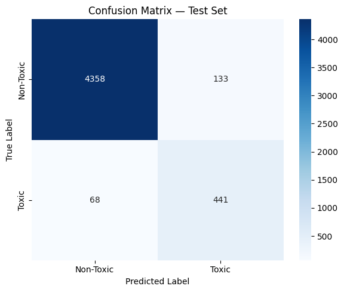
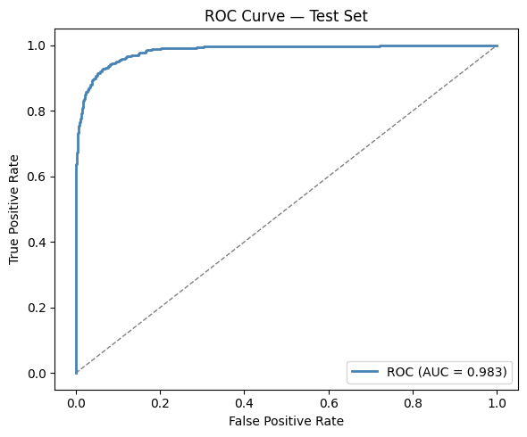

# Toxic Comment Classifier

A BERT-based text classification system fine-tuned on the Jigsaw Toxic Comment dataset. The project includes a training notebook, a REST API built with FastAPI, and an interactive Streamlit interface for real-time inference.

**Live Demo:** [app link](https://djouaheryasmine-toxic-comments-model-app-msrkyo.streamlit.app/)

---

## Overview

This project fine-tunes `bert-base-uncased` to detect toxic content in user-generated text. It is structured as a three-component system: a Jupyter notebook for training, a FastAPI backend that serves the model, and a Streamlit frontend that communicates with the API.

The model is trained on the [Jigsaw Toxic Comment Classification Challenge](https://www.kaggle.com/c/jigsaw-toxic-comment-classification-challenge) dataset and produces binary predictions (toxic / non-toxic) along with confidence probabilities.

---

## Results

| Metric | Value |
|--------|-------|
| Test Accuracy | 0.9598 |
| Test F1-Score | 0.8144 |
| Test AUC-ROC | 0.9827 |

**Per-class performance:**

| Class | Precision | Recall | F1 |
|-------|-----------|--------|----|
| Non-Toxic | 0.98 | 0.97 | 0.98 |
| Toxic | 0.77 | 0.87 | 0.81 |

### Confusion Matrix



### ROC Curve



---

## Project Structure

```
.
├── bert_toxic_finetune.ipynb   # Full training pipeline
├── api.py                      # FastAPI inference server
├── app.py                      # Streamlit user interface
├── requirements.txt            # Python dependencies
├── toxic_bert_model/           # Exported model (generated by notebook)
│   ├── config.json
│   ├── model.safetensors
│   ├── tokenizer.json
│   ├── tokenizer_config.json
│   └── model_meta.json
└── .streamlit/
    └── config.toml             # Forces dark mode, hides toolbar
```

---

## Deployment

The API is deployed on Hugging Face Spaces using Docker. The Streamlit app connects to the remote API via the `API_URL` variable in `app.py`.

---

## Model Details

| Parameter | Value |
|-----------|-------|
| Base model | `bert-base-uncased` |
| Max sequence length | 128 tokens |
| Training epochs | 3 |
| Batch size | 32 |
| Learning rate | 2e-5 |
| Optimizer | AdamW with linear warmup |
| Warmup ratio | 10% |
| Training samples | ~40,000 |

The best checkpoint is selected based on validation F1-score. Early stopping is handled by saving only when validation F1 improves.

---

## License

This project is released under the MIT License.

---

## Acknowledgments

- [Jigsaw / Conversation AI](https://www.kaggle.com/c/jigsaw-toxic-comment-classification-challenge) for the dataset
- [Hugging Face Transformers](https://github.com/huggingface/transformers) for the model and tokenizer implementation
- [Google Research](https://github.com/google-research/bert) for the original BERT architecture
